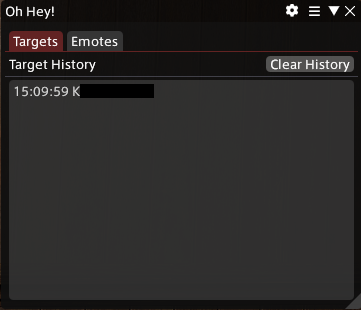
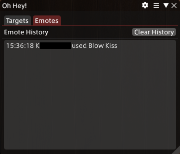

# Main Window

## Overview

You can open the main window by either using the command `/ohhey` (or `/ohhey main` if you prefer)
or by using the "Open" button in the plugin installer (`/xlplugins`).

The main window has two tabs:
- [Targets](#target-tab)
- [Emotes](#emotes-tab)

Both tabs show the most recent recorded events in that respective category.\
Additionally each tab has a "Clear History" button, which deletes the history of that specific tab.\
The little cogwheel in the title bar opens the settings menu.

> [!IMPORTANT]
> These tabs do not store information permanently.
> On game restart the data will be lost!

## Targets Tab
The targets tab lists who was targeting your character recently and when they were targeting you.

If someone is currently targeting you, their name appears in white text,
while people that were targeting you in the past use a grey text.

>[!TIP]
> The timestamp shown is using a 24h clock in the format of `hours:minutes:seconds`

## Emotes Tab
The emotes tab lists who was using which emotes at what time on your character.

>[!TIP]
> The timestamp shown is using a 24h clock in the format of `hours:minutes:seconds`
