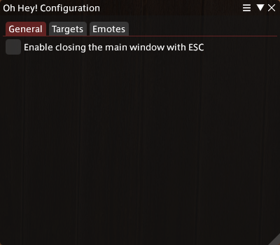
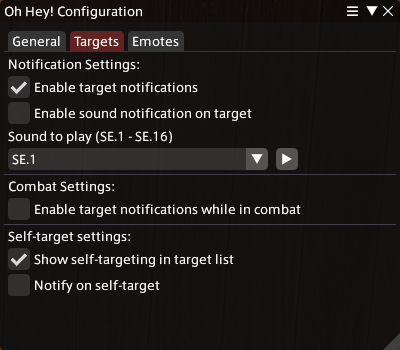
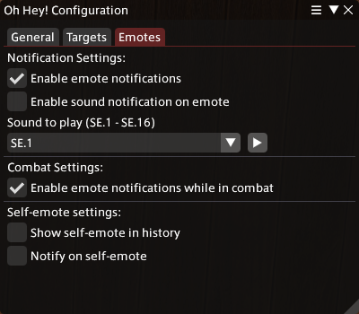

# Settings Window

## Overview

You can open the settings window by using the command `/ohhey settings` (or `/ohhey config` if you prefer),
by pressing the cogwheel in the tile bar of the main window or by using the `Settings` button in the plugin installer (`/xlplugins`).

The settings window has 3 categories:

- [General](#general-settings)
- [Targets](#target-settings)
- [Emotes](#emote-settings)

## General Settings

The general settings mainly include some miscellaneous settings that aren't directly related to the other categories.

<ins>***Enable closing the main window with ESC*** </ins>

**Default:** *disabled*

This setting changes if the main window is allowed to be closed by using the `ESC` key.
If this box is unchecked the window can only be closed by using the `X` button in the title bar.

> [!CAUTION]
> If you enable this setting, the main window will not work as an overlay anymore.

## Target Settings

The targets tab includes all settings related to target notifications.

### Notification Settings

<ins>***Enable target notifications***</ins>

**Default:** *enabled*

If this is enabled, the plugin will notify you when someone targets you.

> [!CAUTION]
> If this is unchecked, all other settings in this tab will have no effect.

<ins>***Enable sound notification on target***</ins>

**Default:** *disabled*

Enables or disables additional audio notifications if someone targets you.

<ins>***Sound to play (SE.1 - SE.16)***</ins>

**Default:** *SE.1*

Here you can set the notification sound that is supposed to be used when someone is targeting you.\
The sound options are the same that you can also use in chat with `<se.1>` to `<se.16>`.

> [!TIP]
> If you want to hear the currently selected sound you can press the play button next to the selector.

### Combat Settings

<ins>***Enable target notifications while in combat***</ins>

**Default:** *disabled*

If this is enabled, you will receive notifications if someone targets you while you are in combat.

> [!NOTE]
> This is disabled by default, so you don't get spammed with notifications if a healer tries to heal you for example.

### Self-target Settings

<ins>***Show self-targeting in target list***</ins>

**Default:** *enabled*

If this is enabled, the target tab in the main window will display your own character in the list if you target yourself.

<ins>***Notify on self-target***</ins>

**Default:** *disabled*

If this is enabled, the plugin will additionally notify you if you target yourself.
> I would be very surprised if you ever need this, for the most part this just exists for me to have an easier time testing the plugin\
> \- Mei

## Emote Settings

The emote tab contains all settings related to emote notifications.

### Notification Settings

<ins>***Enable emote notifications***</ins>

**Default:** *enabled*

If this is enabled, the plugin will notify you when someone emotes at you.

> [!CAUTION]
> If this is unchecked, all other settings in this tab will have no effect.

<ins>***Enable sound notification on emote***</ins>

**Default:** *disabled*

Enables or disables additional audio notifications if someone emotes at you.

<ins>***Sound to play (SE.1 - SE.16)***</ins>

**Default:** *SE.1*

Here you can set the notification sound that is supposed to be used when someone emotes at you.\
The sound options are the same that you can also use in chat with `<se.1>` to `<se.16>`.

> [!TIP]
> If you want to hear the currently selected sound you can press the play button next to the selector.

### Combat Settings

<ins>***Enable emote notifications while in combat***</ins>

**Default:** *enabled*

If this is enabled, you will receive notifications if someone emotes at you while you are in combat.

### Self-target Settings

<ins>***Show self-emote in history***</ins>

**Default:** *disabled*

If this is enabled, the emote tab in the main window will display your own character in the list if you emote at yourself.

<ins>***Notify on self-emote***</ins>

**Default:** *disabled*

If this is enabled, the plugin will additionally notify you if you emote at yourself.
> I would be very surprised if you ever need this, for the most part this just exists for me to have an easier time testing the plugin\
> \- Mei
